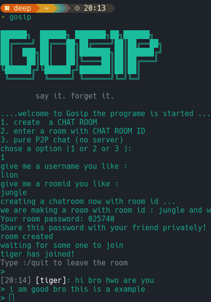

# 🤫 Gosip

> Anonymous encrypted terminal chat. No accounts. No logs. No trace.
> 


Gosip is a lightweight terminal-based chat app built in Go. Two modes — classic encrypted chat via ntfy.sh, or pure P2P with no server at all. When you leave, it's gone.

---

## Features

- Anonymous — no accounts, no sign up
- End-to-end encrypted with AES-256 GCM
- Pure P2P mode — works across different networks (WiFi, mobile data)
- Simple invite code for P2P — no manual IP sharing
- Group chat support in P2P mode
- Auto-generated room passwords
- Colored usernames in terminal
- Timestamps on every message
- Works on Linux, Mac and Windows
- Single binary — no dependencies for the user

---

## Demo

```
██████╗  ██████╗ ███████╗██╗██████╗ 
██╔════╝ ██╔═══██╗██╔════╝██║██╔══██╗
██║  ███╗██║   ██║███████╗██║██████╔╝
██║   ██║██║   ██║╚════██║██║██╔═══╝ 
╚██████╔╝╚██████╔╝███████║██║██║     
 ╚═════╝  ╚═════╝ ╚══════╝╚═╝╚═╝    

        say it. forget it.

....welcome to gosip the program is started ...
1. create a CHAT ROOM
2. enter a room with CHAT ROOM ID
3. pure P2P chat (no server)
chose a option (1 or 2 or 3 ): 3

username: bear
1. create  2. join
1

── share this invite code with your friends ──
Z29zaXAtNzQ3MTI5OjQzOTUwNQ==
(copy the code above and share it privately)
──────────────────────────────────────────────
waiting for peers to connect...

[system]: lion has joined!
> hey lion how are you man
[16:32] [lion]: i am good bro
> great to hear!
```

---

## Installation

### Arch Linux (AUR)(recommended)

If you are on Arch Linux or an Arch-based distribution, you can install `gosip` directly from the AUR using an AUR helper like `yay`:

```bash
yay -S gosip
```

### Linux & Mac

**Option 1 — Build from source:**
```bash
git clone https://github.com/Bearcry55/gosip
cd gosip
go build -o gosip
./gosip
```

**Option 2 — Download binary:**

Linux:
```bash
wget https://github.com/Bearcry55/gosip/releases/latest/download/gosip-linux
chmod +x gosip-linux
./gosip-linux
```

Mac:
```bash
wget https://github.com/Bearcry55/gosip/releases/latest/download/gosip-mac
chmod +x gosip-mac
./gosip-mac
```

**Option 3 — go install:**
```bash
go install github.com/Bearcry55/gosip@latest
```
Then run:
```bash
gosip
```

### Windows

```powershell
git clone https://github.com/Bearcry55/gosip
cd gosip
go build -o gosip.exe
./gosip.exe
```

Or download `gosip.exe` from the [releases page](https://github.com/Bearcry55/gosip/releases/latest).

---

## Requirements

- Go 1.21 or higher → https://golang.org/dl

---

## How It Works

### Classic Mode (options 1 & 2)
```
Create Room  →  auto generates room ID + password
              →  POST system message to ntfy.sh
              →  wait for someone to join

Join Room    →  enter room ID + password
              →  POST join message to ntfy.sh
              →  start chatting

Messages     →  encrypted with AES-256 GCM before sending
              →  stored temporarily on ntfy.sh as gibberish
              →  decrypted only by users with correct password
```

### P2P Mode (option 3)
```
Create Room  →  start WebRTC node
              →  publish address to ntfy.sh (signaling only)
              →  generate invite code (channel + password)
              →  wait for peers to connect

Join Room    →  paste invite code
              →  fetch creator address from ntfy.sh
              →  connect directly via WebRTC
              →  ntfy.sh no longer used after connection

Messages     →  encrypted with AES-256 GCM
              →  sent directly peer to peer
              →  no server involved at any point
```

---

## Commands

| Command | Action |
|---|---|
| `:/quit` | Leave the room |

---

## Privacy

- Messages are encrypted before leaving your machine
- Room password never sent over the network
- No user accounts or registration
- Classic mode: messages expire automatically on ntfy.sh after 12 hours
- P2P mode: only connection address shared via ntfy.sh, messages never touch any server
- No message history stored locally

---

## Built With

- `Go` — core language
- `ntfy.sh` — temporary message transport (classic mode + P2P signaling)
- `github.com/pion/webrtc` — WebRTC P2P networking
- `crypto/aes` — AES-256 GCM encryption
- `github.com/chzyer/readline` — terminal input handling

---

## Roadmap

- [x] Pure P2P mode with invite code
- [x] P2P works across different networks
- [x] Group chat in P2P mode
- [ ] TUI interface
- [ ] Room expiration control
- [ ] File sharing
- [ ] LAN mode (no internet needed)
- [ ] Tor mode

---

## Author

Built by [@Bearcry55](https://github.com/Bearcry55) as a Go learning project.

---

> Gosip. Say it. Forget it.
